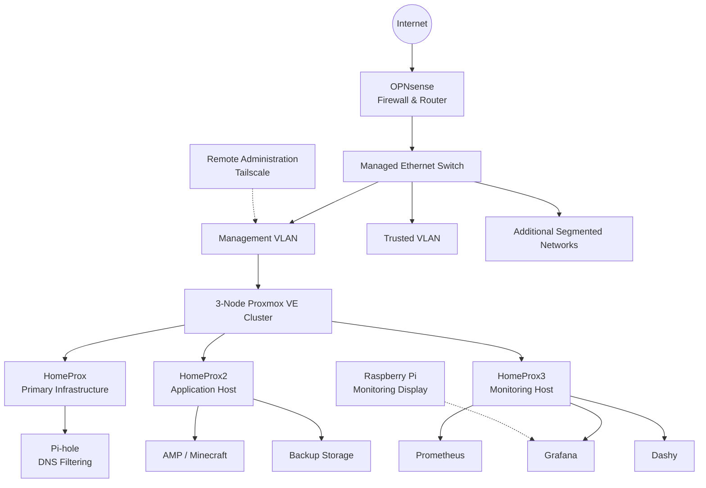

# Homelab Network Architecture

This directory contains architecture diagrams documenting the design of my homelab network.

> Diagrams are simplified for portfolio use and intentionally omit sensitive configuration details.

## Current High-Level Architecture

## Network Design Goals

The network architecture is designed around:

- Segmentation between infrastructure and client networks
- Centralized routing and firewall policy
- Dedicated infrastructure management
- Secure remote administration
- Centralized DNS filtering
- Infrastructure monitoring
- Expandability for future server, IoT, and security-lab networks
- Reduced exposure of administrative services

## Virtualization

The core infrastructure is hosted on a three-node Proxmox VE cluster.

Virtualized services include:

- OPNsense
- Pi-hole
- AMP / Minecraft
- Prometheus
- Grafana
- Dashy

Additional workloads can be deployed without requiring dedicated physical systems for every service.

## Network Segmentation

The environment currently separates management infrastructure from trusted client traffic.

Additional segmentation is planned for:

- Servers
- IoT devices
- Security-testing environments
- Guest/untrusted devices
- Self-hosted services

Firewall policy controls communication between network segments.

## Remote Administration

Tailscale provides encrypted remote administrative access without exposing Proxmox or other management interfaces directly to the public Internet.

## Monitoring

Prometheus collects infrastructure metrics while Grafana provides visualization.

A dedicated Raspberry Pi provides a persistent physical monitoring display.

Future observability improvements include centralized logging, anomaly detection, and exception-based email health reports.

## Future Diagrams

Additional diagrams will document:

- VLAN topology
- Proxmox cluster architecture
- Monitoring and logging architecture
- Backup architecture
- Remote-access architecture
- Security-lab architecture
