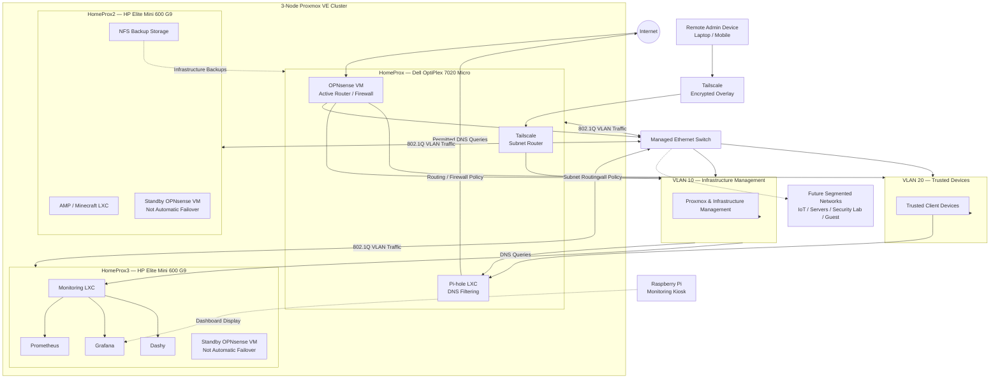

# Technical Homelab Network Topology

## Overview

This diagram documents the logical topology of my homelab and the relationship between the physical network, Proxmox VE cluster, OPNsense firewall, VLANs, infrastructure services, monitoring, and secure remote administration.

The diagram is intentionally sanitized for public documentation and does not expose internal IP addressing or credentials.

---

## Network Topology



---

# Physical Infrastructure

The core environment consists of three mini-PC Proxmox nodes connected to a managed Ethernet switch.

| Node | Hardware | Primary Role |
|---|---|---|
| HomeProx | Dell OptiPlex 7020 Micro | Core network infrastructure |
| HomeProx2 | HP Elite Mini 600 G9 | Applications and backup services |
| HomeProx3 | HP Elite Mini 600 G9 | Monitoring and observability |

The nodes form a three-member Proxmox VE cluster using Corosync.

---

# Layer 2 Network

A managed Ethernet switch provides VLAN-aware Layer 2 connectivity between the physical systems.

The switch is responsible for:

- VLAN membership
- Tagged traffic
- Untagged traffic
- PVID assignment
- Connectivity between infrastructure devices

802.1Q VLAN tagging allows multiple logical networks to share physical Ethernet infrastructure while remaining logically separated.

---

# Layer 3 Network

OPNsense provides Layer 3 services for the environment.

Responsibilities include:

- Default gateway services
- Inter-VLAN routing
- Firewall policy
- DHCP
- Network segmentation
- Internet routing

Traffic moving between network segments is routed through OPNsense, allowing firewall policy to control communication between security boundaries.

---

# Management Network

VLAN 10 is used for infrastructure management.

This network contains or provides access to systems such as:

- Proxmox hosts
- Infrastructure services
- Monitoring
- Administrative interfaces

Separating management traffic from ordinary client traffic reduces unnecessary exposure of infrastructure interfaces.

---

# Trusted Network

VLAN 20 is used for trusted client devices.

This separates normal endpoint traffic from the infrastructure management network.

Communication between the trusted network and infrastructure networks can be controlled through OPNsense firewall policy.

---

# DNS Architecture

Pi-hole provides centralized DNS filtering.

The general DNS path is:

```text
Client
   |
   v
Pi-hole
   |
   v
Upstream DNS
   |
   v
Internet
```

This provides centralized DNS policy and visibility into DNS activity.

---

# Monitoring Architecture

A dedicated LXC container on HomeProx3 hosts the primary monitoring environment.

The monitoring stack includes:

- Prometheus
- Grafana
- Dashy

Prometheus provides metrics collection while Grafana provides visualization.

Dashy provides a centralized interface for accessing homelab services.

A Raspberry Pi is used as a dedicated physical kiosk for displaying monitoring information.

---

# Remote Administration

Tailscale provides secure remote administrative connectivity.

HomeProx operates as a subnet router for the management network.

The general remote-access path is:

```text
Remote Laptop / Mobile Device
            |
            v
       Tailscale
            |
            v
   HomeProx Subnet Router
            |
            v
     Management VLAN
            |
            v
 Internal Infrastructure
```

This allows authorized remote devices to reach internal management services without directly publishing those interfaces to the public Internet.

---

# Backup Architecture

HomeProx2 provides NFS-based backup storage for infrastructure backups.

Proxmox `vzdump` is used to create compressed VM and LXC recovery archives.

The backup architecture is being expanded to provide consistent automated off-node protection for important workloads.

Restore testing and backup-health monitoring are also planned.

---

# Firewall Boundaries

The architecture uses OPNsense as the primary policy-enforcement point between logical networks.

Conceptually:

```text
Trusted Network
      |
      v
   OPNsense
      |
 Firewall Policy
      |
      v
Management Network
```

This allows communication to be permitted according to operational requirements rather than allowing unrestricted traffic between every network.

---

# Virtualization Boundaries

Several critical infrastructure services are virtualized.

This provides flexibility but also creates dependencies.

For example, HomeProx currently hosts:

- Active OPNsense
- Pi-hole
- Tailscale subnet routing

Maintenance on this hypervisor therefore requires consideration of the network services that depend on it.

This dependency was identified during rolling Proxmox maintenance and is incorporated into future change planning.

---

# Firewall Resiliency

Additional OPNsense virtual machines exist on other Proxmox nodes as standby instances.

They are intentionally represented as:

```text
Standby OPNsense
Not Automatic Failover
```

They should not be considered a high-availability firewall solution until failover behavior has been explicitly configured and tested.

---

# Future Segmentation

The architecture is designed to support additional network segments.

Potential future networks include:

- IoT devices
- Servers
- Security-testing systems
- Guest devices
- Self-hosted services

Each network can receive its own firewall policy based on its purpose and trust level.

---

# Future Observability

The monitoring environment is planned to expand beyond metrics collection.

Future architecture may include:

```text
Infrastructure
      |
      +-------- Metrics --------> Prometheus
      |
      +-------- Logs -----------> Grafana Loki
                                      |
                                      v
                                   Grafana
                                      |
                                      v
                          Exception-Based Reporting
```

The goal is to identify conditions requiring attention rather than continuously reporting normal infrastructure behavior.

---

# Security Principles

The network architecture follows several core principles.

## Segmentation

Systems with different purposes and trust levels should not automatically share the same network.

## Least Privilege

Inter-network communication should be permitted only where operationally required.

## Reduced Exposure

Administrative services should not be directly exposed to the public Internet unless absolutely necessary.

## Defense in Depth

Security relies on multiple controls, including:

- OPNsense firewalling
- VLAN segmentation
- Tailscale
- DNS filtering
- Endpoint security
- Monitoring
- Backups

## Recoverability

Infrastructure security also includes the ability to recover from configuration mistakes, failed updates, storage failures, and other incidents.

---

# Skills Demonstrated

This architecture demonstrates practical experience with:

- Network architecture
- Proxmox VE
- OPNsense
- VLANs
- IEEE 802.1Q
- Managed switching
- Linux bridges
- Inter-VLAN routing
- Firewall policy
- DNS
- Pi-hole
- Tailscale
- Secure remote administration
- Prometheus
- Grafana
- Infrastructure monitoring
- LXC
- Virtual machines
- NFS
- Backup architecture
- Network segmentation
- Infrastructure documentation

---

# Project Status

**Operational / Expanding**

The core architecture is operational with:

- Three-node Proxmox cluster
- OPNsense routing and firewalling
- Management VLAN
- Trusted VLAN
- Pi-hole DNS
- Prometheus/Grafana monitoring
- Tailscale remote-access infrastructure
- Proxmox backup infrastructure

Additional segmentation, centralized logging, backup improvements, firewall resiliency, and security-monitoring capabilities remain planned.
